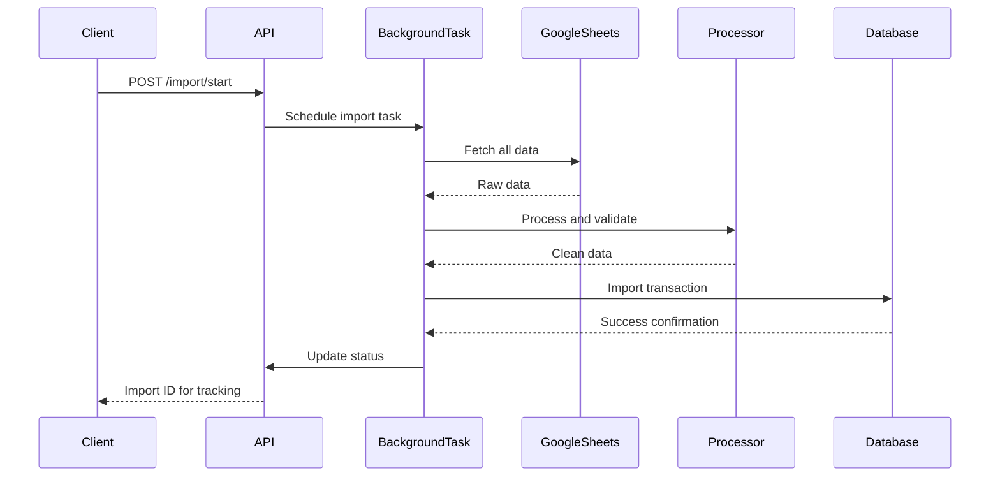

# Data Importer Service - Архитектура

## Обзор

**Data Importer Service** - это **микросервис на базе FastAPI**, предназначенный для импорта и обработки данных IT Mentor Community Platform из Google Sheets в структурированную базу данных. Сервис реализует **асинхронную обработку данных**, **интеллектуальную фильтрацию** и **комплексную валидацию** для обеспечения высококачественного импорта данных.

## Высокоуровневая системная архитектура

### Основная философия дизайна

Сервис следует **паттерну многослойной архитектуры** с четким разделением ответственности:

```
┌─────────────────────────────────────────────────────────────┐
│                    API Layer (FastAPI)                      │
├─────────────────────────────────────────────────────────────┤
│                   Business Logic Layer                      │
│  ┌─────────────────┐  ┌─────────────────┐  ┌──────────────┐ │
│  │ Import Service  │  │ Data Processor  │  │ Google       │ │
│  │                 │  │                 │  │ Sheets       │ │
│  └─────────────────┘  └─────────────────┘  └──────────────┘ │
├─────────────────────────────────────────────────────────────┤
│                    Data Access Layer                        │
│  ┌─────────────────┐  ┌─────────────────┐  ┌──────────────┐ │
│  │ SQLAlchemy ORM  │  │ Database Adapter│  │ Pydantic     │ │
│  │                 │  │                 │  │ Schemas      │ │
│  └─────────────────┘  └─────────────────┘  └──────────────┘ │
├─────────────────────────────────────────────────────────────┤
│                   Infrastructure Layer                      │
│  ┌─────────────────┐  ┌─────────────────┐  ┌──────────────┐ │
│  │ SQLite/PostgreSQL│ │ Alembic         │  │ Configuration│ │
│  │                 │  │ Migrations      │  │ Management   │ │
│  └─────────────────┘  └─────────────────┘  └──────────────┘ │
└─────────────────────────────────────────────────────────────┘
```

### Ключевые архитектурные принципы

1. **Асинхронный дизайн (Async-First)**: Все операции ввода-вывода асинхронны с использованием `asyncio`
2. **Абстракция базы данных**: Универсальный адаптер для SQLite (разработка) и PostgreSQL (продакшен)
3. **Конфигурация через настройки**: Конфигурация на основе окружения с использованием Pydantic v2
4. **Фокус на качестве данных**: Комплексные механизмы валидации и фильтрации
5. **Отказоустойчивость**: Graceful обработка ошибок с детальным логированием
6. **Фоновая обработка**: Неблокирующие операции импорта с отслеживанием статуса

## Технологический стек

### Основные фреймворки
- **Python 3.13**: Последняя версия Python с современными возможностями
- **FastAPI 0.121.1**: Современный асинхронный веб-фреймворк с автоматической документацией
- **SQLAlchemy 2.0.44**: Асинхронный ORM с type hints
- **Pydantic v2**: Валидация данных и управление настройками

### База данных и миграции
- **SQLite**: База данных для разработки и тестирования
- **PostgreSQL**: Поддержка базы данных для продакшена
- **Alembic**: Управление миграциями базы данных
- **asyncpg/aiosqlite**: Асинхронные драйверы баз данных

### Внешние интеграции
- **Google Sheets API v4**: Интеграция с источником данных
- **Google OAuth2**: Аутентификация сервисного аккаунта
- **HTTPX**: Асинхронный HTTP клиент для внешних сервисов

### Разработка и развертывание
- **Rye**: Современный пакетный менеджер Python
- **Uvicorn**: ASGI сервер для продакшена
- **Structlog**: Структурированное логирование
- **Black/Ruff/MyPy**: Инструменты качества кода

## Организация модулей и ответственности

### Ядро приложения (`src/data_importer/`)

#### `main.py` - Точка входа приложения
- **Ответственности**: Управление жизненным циклом FastAPI, конфигурация middleware, регистрация маршрутов
- **Ключевые возможности**:
  - Асинхронное управление жизненным циклом для инициализации базы данных
  - Конфигурация middleware (CORS, логирование, обработка запросов)
  - Эндпоинты для проверки работоспособности
  - Автоматическая документация API

#### `config/` - Управление конфигурацией
- **`settings.py`**: Конфигурация на основе окружения с использованием Pydantic v2
  - Настройки подключения к базе данных
  - Параметры интеграции с Google Sheets
  - Конфигурация API и настройки безопасности
  - Конфигурация обработки импорта
- **`database.py`**: Универсальный адаптер базы данных
  - Поддержка SQLite и PostgreSQL
  - Управление асинхронными сессиями
  - Конфигурация пулов соединений

### Модели данных (`src/data_importer/models/`)

#### `user.py` - Управление пользователями
- **`User`**: Основная сущность пользователя с интеграцией Telegram и GitHub
- **`Role`**: Управление ролями пользователей (STUDENT, MENTOR)
- **`MentorProfile`**: Расширенный профиль ментора
- **`user_roles`**: Таблица связи "многие ко многим"

#### `project.py` - Модели проектов и ревью
- **`Project`**: Проекты студентов
- **`Review`**: Оценки проектов менторами
- Связи внешних ключей для обеспечения целостности данных

### Слой API (`src/data_importer/api/`)

#### `endpoints/import_.py` - Операции импорта
- **`POST /api/v1/import/start`**: Запуск процесса импорта в фоне
- **`GET /api/v1/import/status/{import_id}`**: Мониторинг прогресса импорта
- **`POST /api/v1/import/dry-run`**: Тест импорта без изменений в базе данных

**Принципы дизайна API**:
- RESTful дизайн эндпоинтов
- Комплексные модели запросов/ответов
- Управление фоновыми задачами с отслеживанием статуса
- Детальная обработка ошибок и логирование

### Бизнес-логика (`src/data_importer/services/`)

#### `import_service.py` - Оркестратор основного импорта
- **Ответственности**: Управление полным процессом импорта
- **Ключевые возможности**:
  - Управление транзакциями базы данных
  - Стратегия полной замены данных
  - Отображение связей и связывание
  - Статистика импорта и отчетность

**Поток процесса импорта**:
```python
1. Получение данных → 2. Валидация → 3. Обработка → 4. Импорт в БД → 5. Отчетность
```

#### `google_sheets.py` - Интеграция с Google Sheets
- **Ответственности**: Интеграция с внешним источником данных
- **Ключевые возможности**:
  - Параллельное получение данных из нескольких таблиц
  - Аутентификация сервисного аккаунта
  - Резервное копирование сырых данных для отладки
  - Комплексная обработка ошибок

**Источники данных**:
- **Основной spreadsheet** (`15ItyrC-p1jnuTjIaFG9GFcUYltuiRDYr_hBsl6riqrQ`):
  - Студенты: "Telegram аккаунты студентов!A2:C"
  - Проекты: "Projects!A2:J"
  - Ревью: "Reviews!A2:I"
- **Spreadsheet менторов** (`1zxDrkL_OlJR-oLfT5Saphn9jEdmUxXWSTV7PvtGbaO8`):
  - Менторы: "Менторы!E5:J29"

#### `data_processor.py` - Движок обработки данных
- **Ответственности**: Трансформация и фильтрация данных
- **Ключевые возможности**:
  - Нормализация имен пользователей Telegram
  - Валидация и нормализация URL GitHub
  - Гибкие правила фильтрации
  - Парсинг русских названий периодов
  - Метрики качества данных

**Логика фильтрации**:
- **Студенты**: Должны иметь ИЛИ имя пользователя Telegram, ИЛИ URL GitHub
- **Менторы**: Должны иметь имя пользователя Telegram (GitHub опционально)
- **Проекты**: Должны иметь имя и URL GitHub автора
- **Ревью**: Должны иметь ссылку на ментора и проект

### Валидация данных (`src/data_importer/utils/`)

#### `validation.py` - Утилиты валидации
- **Функции нормализации**:
  - `normalize_telegram_username()`: Обработка префикса @ и валидация
  - `normalize_github_url()`: Обработка нескольких форматов URL
  - `parse_period()`: Парсинг русских названий месяцев
- **Обеспечение качества**:
  - Валидация длины строк
  - Валидация типов данных
  - Стандартизация форматов

## Дизайн схемы базы данных

### Диаграмма сущностей и связей

```
┌─────────────────┐         ┌─────────────────┐
│      roles      │         │  users_roles    │
│  - id (PK)      │◄────────┤  - user_id (FK) │
│  - name         │         │  - role_id (FK) │
└─────────────────┘         └─────────────────┘
                                   │
                                   ▼
┌─────────────────┐         ┌─────────────────┐
│      users      │◄────────┤ mentor_profiles │
│  - id (PK)      │         │  - user_id (FK) │
│  - telegram_id  │         │  - full_name    │
│  - telegram_user│         │  - languages    │
│  - github_url   │         │  - services     │
└─────────────────┘         │  - price_type   │
        │                  │  - website_url  │
        ▼                  └─────────────────┘
┌─────────────────┐                │
│      reviews    │                ▼
│  - id (PK)      │         ┌─────────────────┐
│  - project_id   │         │    projects     │
│  - mentor_id    │         │  - id (PK)      │
│  - period_date  │         │  - name         │
│  - review_type  │         │  - language     │
│  - review_url   │         │  - repo_url     │
└─────────────────┘         │  - student_id   │
                           └─────────────────┘
```

### Ключевые дизайн-решения

1. **Ориентация на пользователя**: Все сущности связаны с пользователями
2. **Гибкая система ролей**: Отношение "многие ко многим" позволяет множественные роли
3 **Аудит**: Метки времени и связи для отслеживания происхождения данных
4. **Стратегия индексации**: Оптимизация для распространенных паттернов запросов

## Поток данных и конвейер обработки

### 1. Поток запуска импорта


### 2. Конвейер обработки данных
```
Данные из Google Sheets
         ↓
   Валидация и очистка
         ↓
      Правила фильтрации
         ↓
   Нормализация данных
         ↓
   Отображение связей
         ↓
   Транзакция в БД
         ↓
   Статистика импорта
```

### 3. Обеспечение качества данных
- **Многоуровневая валидация**: Формат, бизнес-правила, целостность ссылок
- **Статистика фильтрации**: Отслеживание отфильтрованных записей и причин
- **Отслеживание ошибок**: Комплексное логирование с контекстом
- **Механизмы резервирования**: Сохранение сырых и обработанных данных

## Принципы дизайна API

### RESTful архитектура
- **Ресурсные эндпоинты**: `/api/v1/import/*`
- **Семантика HTTP методов**: GET для получения, POST для действий
- **Согласованность кодов статуса**: Правильные HTTP коды статуса
- **Согласование содержимого**: Формат запросов/ответов JSON

### Дизайн эндпоинтов

#### 1. `POST /api/v1/import/start` - Инициация асинхронной операции
- **Возвращает**: ID импорта для отслеживания
- **Обработка**: Фоновая задача с обновлениями статуса
- **Пример ответа**:
```json
{
    "message": "Import process started successfully",
    "import_id": "import_1699912345678",
    "status": "started",
    "statistics": {}
}
```

#### 2. `GET /api/v1/import/status/{import_id}` - Мониторинг операций
- **Возвращает**: Текущий статус и информацию о прогрессе
- **Опрос**: Инициированное клиентом отслеживание прогресса
- **Пример ответа**:
```json
{
    "status": "processing",
    "message": "Processing student data...",
    "progress": {
        "stage": "data_validation",
        "students_processed": 250,
        "total_students": 500
    }
}
```

#### 3. `POST /api/v1/import/dry-run` - Валидация без рисков
- **Возвращает**: Статистику обработки без изменений в базе данных
- **Валидация**: Полное тестирование конвейера
- **Пример ответа**:
```json
{
    "message": "Dry run completed successfully",
    "statistics": {
        "raw_records": {"students": 600, "mentors": 25},
        "processed_records": {"students": 544, "mentors": 25},
        "filtered_records": {
            "students": 56,
            "reasons": {
                "no_telegram_or_github": 45,
                "invalid_format": 8,
                "duplicates": 3
            }
        }
    }
}
```

### Стратегия обработки ошибок
- **Структурированные ответы об ошибках**: Согласованный формат ошибок
- **Коды HTTP статуса**: Подходящие коды для разных типов ошибок
- **Детальное логирование**: Комплексный контекст ошибок
- **Руководство для клиента**: Информативные сообщения об ошибках

## Конфигурация и развертывание

### Конфигурация окружения
- **Разработка**: База данных SQLite, режим отладки, локальное хранилище файлов
- **Продакшен**: PostgreSQL, оптимизированные настройки, мониторинг включен
- **Безопасность**: Управление переменными окружения, ротация секретов

### Архитектура развертывания
```
┌─────────────────┐    ┌─────────────────┐    ┌─────────────────┐
│   Load Balancer │───▶│   FastAPI App   │───▶│   Database      │
│   (External)    │    │   (Multiple)    │    │   (PostgreSQL)  │
└─────────────────┘    └─────────────────┘    └─────────────────┘
                              │
                              ▼
                       ┌─────────────────┐
                       │   Google Sheets │
                       │   API (External)│
                       └─────────────────┘
```

### Учет масштабирования
- **Горизонтальное масштабирование**: Stateless дизайн приложения
- **Масштабирование базы данных**: Пулы соединений и оптимизация запросов
- **Фоновая обработка**: Celery или подобное для распределенных задач
- **Мониторинг**: Проверки работоспособности и сбор метрик

## Внешние зависимости и интеграции

### Интеграция с Google Sheets
- **Аутентификация**: Сервисный аккаунт с правами только на чтение
- **Источники данных**: Несколько таблиц с конкретными диапазонами
- **Обработка ошибок**: Лимиты API и логика повторных попыток
- **Согласованность данных**: Атомарные операции получения

### Интеграция с базой данных
- **Поддержка нескольких БД**: SQLite для разработки, PostgreSQL для продакшена
- **Управление соединениями**: Асинхронные пулы соединений
- **Управление миграциями**: Alembic с автоматизированным развертыванием
- **Оптимизация производительности**: Оптимизация запросов и индексация

### Аутентификация и безопасность
- **Аутентификация на JWT**: Валидация и обновление токенов
- **Контроль доступа на основе ролей**: Управление ролями пользователей
- **Управление секретами**: Конфигурация на основе окружения
- **Поддержка CORS**: Обработка кросс-доменных запросов

## Мониторинг и observability

### Стратегия логирования
- **Структурированное логирование**: JSON формат с согласованными полями
- **Уровни логирования**: Подходящее использование уровней (DEBUG, INFO, WARNING, ERROR)
- **Отслеживание контекста**: ID запроса и контекст пользователя
- **Метрики производительности**: Тайминги операций и использование ресурсов

### Проверки работоспособности
- **Работоспособность приложения**: Доступность сервиса и конфигурации
- **Подключение к базе данных**: Статус соединения и производительность
- **Статус внешних сервисов**: Доступность API Google Sheets
- **Мониторинг ресурсов**: Использование памяти и CPU

### Сбор метрик
- **Бизнес-метрики**: Уровни успешного импорта, индикаторы качества данных
- **Технические метрики**: Время ответа API, уровни ошибок
- **Метрики базы данных**: Использование соединений, производительность запросов
- **Системные метрики**: Утилизация ресурсов и показатели масштабирования

## Стратегия разработки и тестирования

### Обеспечение качества
- **Качество кода**: Форматирование Black, проверка Ruff, проверка типов MyPy
- **Тестовый фреймворк**: pytest с асинхронной поддержкой
- **Отчеты о покрытии**: Комплексные метрики покрытия тестами
- **Pre-commit хуки**: Автоматизированная проверка качества

### Рабочий процесс разработки
- **Управление пакетами**: Rye для управления зависимостями
- **Изоляция окружения**: Виртуальное окружение с Python 3.13
- **Миграции базы данных**: Alembic с контролем версий
- **Документация API**: Автоматическая генерация OpenAPI

## Производительность и оптимизация

### Оптимизация базы данных
- **Пулы соединений**: Настраиваемые размеры пулов и таймауты
- **Оптимизация запросов**: Эффективные паттерны запросов и индексация
- **Управление транзакциями**: Атомарные операции с откатом
- **Пакетная обработка**: Массовые операции для больших наборов данных

### Производительность приложения
- **Асинхронная обработка**: Неблокирующие операции ввода-вывода
- **Фоновые задачи**: Длительные операции в фоне
- **Стратегии кеширования**: Настраиваемое кеширование для часто используемых данных
- **Управление ресурсами**: Оптимизация памяти и CPU

## Вопросы безопасности

### Защита данных
- **Валидация входных данных**: Комплексная валидация и санитизация данных
- **Предотвращение SQL-инъекций**: Параметризованные запросы и использование ORM
- **Аутентификация**: Валидация JWT токенов и механизм обновления
- **Авторизация**: Контроль доступа на основе ролей

### Безопасность инфраструктуры
- **Управление секретами**: Конфигурация на основе окружения
- **Сетевая безопасность**: Шифрование TLS и безопасная связь
- **Контроль доступа**: Принцип наименьших привилегий
- **Аудит логирования**: Комплексное логирование активности

## Заключение

**Data Importer Service** представляет **хорошо архитектурированный микросервис**, который следует современным принципам разработки программного обеспечения. Его **многослойная архитектура**, **асинхронный дизайн** и **комплексная валидация данных** делают его подходящим для развертывания в продакшене в экосистеме IT Mentor Community Platform.

Сервис успешно сбалансирует **функциональные требования** с **техническим совершенством**, предоставляя надежные возможности импорта данных при сохранении качества кода, тестируемости и операционного совершенства.

Ключевые преимущества:
- **Масштабируемая архитектура** поддерживающая горизонтальное масштабирование
- **Отказоустойчивая обработка** ошибок и комплексное логирование
- **Гибкая конфигурация** поддерживающая несколько сред развертывания
- **Высококачественный код** с современными практиками Python
- **Комплексное тестирование** и процессы обеспечения качества

Эта архитектурная основа предоставляет прочную базу для будущих улучшений и масштабирования по мере роста платформы.