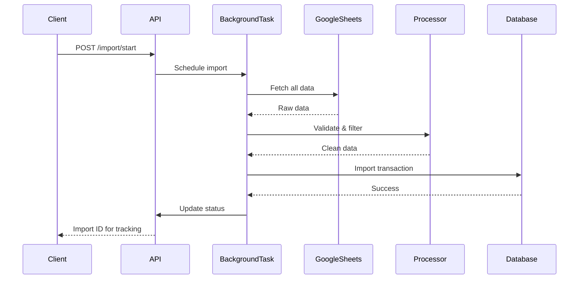

# Data Importer Service

🚀 **FastAPI микросервис** для импорта и обработки данных IT Mentor Community Platform из Google Sheets в базу данных с интеллектуальной фильтрацией и валидацией.

## ✨ Ключевые возможности

- **🔄 Асинхронная обработка**: Неблокирующий импорт больших объемов данных
- **🧠 Умная фильтрация**: Гибкие правила фильтрации студентов (Telegram ИЛИ GitHub)
- **📊 Комплексная валидация**: Многоуровневая проверка качества данных
- **🔧 Мониторинг**: Отслеживание прогресса и статуса импорта в реальном времени
- **🗄️ Мульти-БД**: Поддержка SQLite (разработка) и PostgreSQL (продакшен)
- **📝 Auto-Docs**: Автоматическая генерация API документации

## 🏗️ Архитектура

Подробная архитектурная документация доступна в [**ARCHITECTURE.md**](ARCHITECTURE.md)

### Основные компоненты

```
┌─────────────────────────────────────────────────────────────┐
│                    API Layer (FastAPI)                      │
├─────────────────────────────────────────────────────────────┤
│                   Business Logic Layer                      │
│  ┌─────────────────┐  ┌─────────────────┐  ┌──────────────┐ │
│  │ Import Service  │  │ Data Processor  │  │ Google       │ │
│  │                 │  │                 │  │ Sheets       │ │
│  └─────────────────┘  └─────────────────┘  └──────────────┘ │
├─────────────────────────────────────────────────────────────┤
│                    Data Access Layer                        │
│  ┌─────────────────┐  ┌─────────────────┐  ┌──────────────┐ │
│  │ SQLAlchemy ORM  │  │ Database Adapter│  │ Pydantic     │ │
│  │                 │  │                 │  │ Schemas      │ │
│  └─────────────────┘  └─────────────────┘  └──────────────┘ │
└─────────────────────────────────────────────────────────────┘
```

## 🚀 Технологический стек

- **Python 3.13** - последняя версия Python с современными возможностями
- **FastAPI 0.121.1** - современный async веб-фреймворк с автоматической документацией
- **SQLAlchemy 2.0.44** - асинхронный ORM с type hints
- **Pydantic v2** - валидация данных и управление настройками
- **Rye** - современный пакетный менеджер Python
- **Alembic** - миграции базы данных
- **SQLite** - для разработки и тестирования
- **PostgreSQL** - для продакшена
- **Google Sheets API v4** - интеграция с внешним источником данных

## 📁 Структура проекта

```
data-importer/
├── src/data_importer/           # Основной пакет приложения
│   ├── main.py                  # Точка входа FastAPI приложения
│   ├── config/                  # Управление конфигурацией
│   │   ├── settings.py          # Pydantic настройки окружения
│   │   └── database.py          # Универсальный адаптер БД
│   ├── models/                  # SQLAlchemy модели данных
│   │   ├── user.py              # User, Role, MentorProfile
│   │   └── project.py           # Project, Review
│   ├── services/                # Слой бизнес-логики
│   │   ├── import_service.py    # Оркестратор импорта
│   │   ├── google_sheets.py     # Интеграция с Google Sheets
│   │   └── data_processor.py    # Обработка и валидация данных
│   ├── api/endpoints/           # REST API эндпоинты
│   │   └── import_.py           # Эндпоинты импорта
│   └── utils/                   # Утилиты и помощники
│       └── validation.py        # Функции валидации данных
├── migrations/                  # Alembic миграции базы данных
├── scripts/                     # Скрипты разработки и развертывания
├── backups/                     # Бэкапы данных импорта
├── ARCHITECTURE.md              # Подробная архитектурная документация
├── pyproject.toml              # Конфигурация проекта и зависимостей
└── README.md                    # Этот файл
```

## 🛠️ Установка и запуск

### Требования

- Python 3.13+
- Rye пакетный менеджер
- Google Sheets API credentials

### Быстрый старт

1. **Клонирование и установка:**
   ```bash
   cd /Users/dmitry/Project/meta2/data-importer
   ./scripts/init_project.sh
   ```

2. **Настройка окружения:**
   ```bash
   # Отредактируйте .env файл с вашими настройками
   cp .env.example .env
   # Укажите путь к вашим Google Sheets credentials
   ```

3. **Запуск development сервера:**
   ```bash
   ./scripts/run_dev.sh
   ```

4. **Проверка работы:**
   - API документация: http://localhost:8000/docs
   - Health check: http://localhost:8000/health
   - Альтернативные доки: http://localhost:8000/redoc

### Ручная установка

1. **Установка зависимостей:**
   ```bash
   rye sync
   ```

2. **Настройка окружения:**
   ```bash
   cp .env.example .env
   # Отредактируйте .env с вашими настройками
   ```

3. **Миграции базы данных:**
   ```bash
   rye run alembic upgrade head
   ```

4. **Запуск:**
   ```bash
   rye run uvicorn src.data_importer.main:app --reload
   ```

## 📚 API Документация

После запуска сервиса доступны следующие эндпоинты:

### Основные эндпоинты
- **Swagger UI**: http://localhost:8000/docs
- **ReDoc**: http://localhost:8000/redoc
- **Health Check**: http://localhost:8000/health
- **Root Info**: http://localhost:8000/

### REST API

#### 1. Тестовый импорт (Dry Run)
```bash
curl -X POST "http://localhost:8000/api/v1/import/dry-run" \
  -H "Content-Type: application/json"
```

#### 2. Запуск полного импорта
```bash
curl -X POST "http://localhost:8000/api/v1/import/start" \
  -H "Content-Type: application/json"
```
Ответ:
```json
{
  "message": "Import process started successfully",
  "import_id": "import_1699912345678",
  "status": "started"
}
```

#### 3. Проверка статуса импорта
```bash
curl -X GET "http://localhost:8000/api/v1/import/status/import_1699912345678"
```

### Фильтрация данных

Сервис применяет интеллектуальную фильтрацию:
- **Студенты**: Импортируются при наличии Telegram username **ИЛИ** GitHub URL
- **Менторы**: Требуется Telegram username
- **Проекты**: Валидация GitHub URL автора
- **Ревью**: Проверка связи ментора и проекта

## 🧪 Тестирование

```bash
# Запустить все тесты с покрытием
./scripts/run_tests.sh

# Или через Rye
rye run pytest

# С покрытием кода
rye run pytest --cov=src/data_importer --cov-report=html
```

## 📊 Google Sheets Integration

Сервис работает с двумя spreadsheet:

- **Основной spreadsheet:** `15ItyrC-p1jnuTjIaFG9GFcUYltuiRDYr_hBsl6riqrQ`
  - Students: "Telegram аккаунты студентов!A2:C"
  - Projects: "Projects!A2:J"
  - Reviews: "Reviews!A2:I"

- **Spreadsheet менторов:** `1zxDrkL_OlJR-oLfT5Saphn9jEdmUxXWSTV7PvtGbaO8`
  - Mentors: "Менторы!E5:J29"

## 🔧 Конфигурация

Основные настройки в `.env`:

```bash
# База данных (SQLite для разработки)
DATABASE_URL=sqlite+aiosqlite:///./data_importer_dev.db

# Google Sheets
GOOGLE_SHEETS_CREDENTIALS_PATH=/path/to/secret.json

# Приложение
DEBUG=true
ENVIRONMENT=development
PORT=8000
```

## 📝 Разработка

### Добавление зависимостей

```bash
# Основные зависимости
rye add package_name

# Dev зависимости
rye add --dev package_name
```

### Миграции базы данных

```bash
# Создать новую миграцию
rye run alembic revision --autogenerate -m "description"

# Применить миграции
rye run alembic upgrade head

# Откатить миграцию
rye run alembic downgrade -1
```

### Качество кода

```bash
# Форматирование кода
rye run black src/

# Проверка линтером
rye run ruff check src/

# Проверка типов
rye run mypy src/
```


### 🤖 Автоматизация (Droids)

Для удобства разработки доступны автоматизированные скрипты (дроиды):

- **Коммит с проверками**:
  ```bash
  ./.factory/commands/commit-droid.sh -m "Ваше сообщение"
  ```
  Автоматически запускает форматирование, линтинг и тесты перед коммитом.

- **Создание PR**:
  ```bash
  ./.factory/commands/pr-create.sh --title "Title" --body "Desc" --branch "feature/name"
  ```
  Создает ветку, коммитит, пушит и открывает PR.

## 🏗️ Архитектурные принципы

- **🏛️ Layered Architecture**: Четкое разделение на API, бизнес-логику и доступ к данным
- **🔄 Async-First Design**: Полностью асинхронный код для высокой производительности
- **🗄️ Database Abstraction**: Универсальный адаптер для SQLite и PostgreSQL
- **⚙️ Configuration-Driven**: Pydantic v2 с автоматической загрузкой из окружения
- **🧪 Background Processing**: Неблокирующие операции с отслеживанием статуса
- **🛡️ Fault Tolerance**: Graceful error handling и детальное логирование

## 🔄 Процесс импорта данных



## 📈 Мониторинг и observability

- **Health Checks**: Комплексная проверка состояния сервиса
- **Structured Logging**: JSON форматирование с контекстом
- **API Metrics**: Автоматическая сборка метрик производительности
- **Error Tracking**: Детальное логирование ошибок с контекстом

## 🚀 Production-ready особенности

- **Horizontal Scaling**: Stateless дизайн для масштабирования
- **Database Pooling**: Оптимизированное управление соединениями
- **Graceful Shutdown**: Корректная остановка с завершением операций
- **Environment Isolation**: Разные конфигурации для dev/staging/prod

## 📚 Дополнительная документация

- **📖 Полная архитектура**: [ARCHITECTURE.md](ARCHITECTURE.md)
- **🔧 API справка**: http://localhost:8000/docs (после запуска)
- **🧪 Тестирование**: Интегрированные тесты pytest
- **⚙️ Конфигурация**: Подробное описание настроек

---

**Data Importer Service** - готовое к продакшену решение для импорта данных с современными практиками разработки! 🎉
