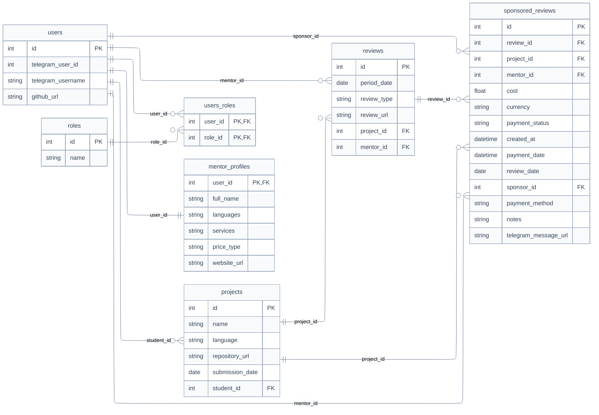

```mermaid
---
config:
  theme: neutral
  layout: elk
  themeVariables:
    primaryColor: "#E2E8F0"        # фон таблицы
    primaryBorderColor: "#94A3B8"  # граница таблицы
    primaryTextColor: "#1F2937"    # текст
    lineColor: "#64748B"           # линии связей
    tertiaryColor: "#F8FAFC"       # фон заголовка
---
erDiagram
    direction LR
    users {
      int id PK
      int telegram_user_id
      string telegram_username
      string github_url
    }

    roles {
      int id PK
      string name
    }

    users_roles {
      int user_id PK, FK
      int role_id PK, FK
    }

    mentor_profiles {
      int user_id PK, FK
      string full_name
      string languages
      string services
      string price_type
      string website_url
    }

    projects {
      int id PK
      string name
      string language
      string repository_url
      date submission_date
      int student_id FK
    }

    reviews {
      int id PK
      date period_date
      string review_type
      string review_url
      int project_id FK
      int mentor_id FK
    }

    sponsored_reviews {
      int id PK
      int review_id FK
      int project_id FK
      int mentor_id FK
      float cost
      string currency
      string payment_status
      datetime created_at
      datetime payment_date
      date review_date
      int sponsor_id FK
      string payment_method
      string notes
      string telegram_message_url
    }

    %% Связи (упорядочены для управления макетом)
    users ||--o{ projects : "student_id"
    users ||--|| mentor_profiles : "user_id"
    users ||--o{ reviews : "mentor_id"
    projects ||--o{ reviews : "project_id"

    users ||--o{ users_roles : "user_id"
    roles ||--o{ users_roles : "role_id"

    reviews ||--o{ sponsored_reviews : "review_id"
    projects ||--o{ sponsored_reviews : "project_id"
    users ||--o{ sponsored_reviews : "mentor_id"
    users ||--o{ sponsored_reviews : "sponsor_id"

    %% Глобальные стили для таблиц ER
    classDef default fill:#F8FAFC,stroke:#94A3B8,color:#334155,stroke-width:1px
```
