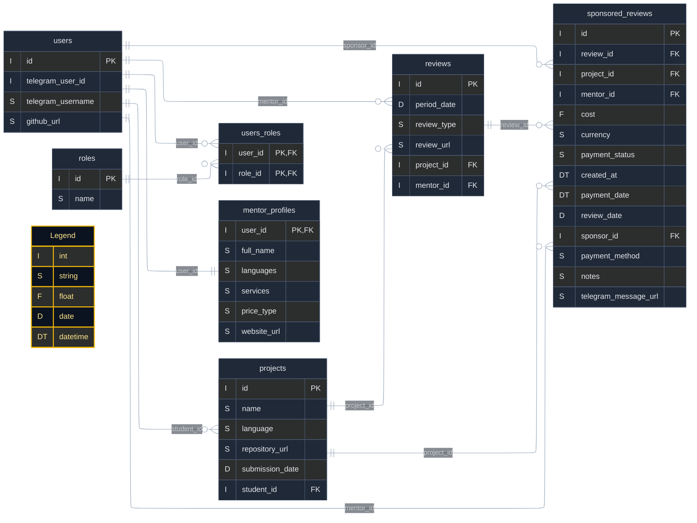

```mermaid
---
config:
  theme: dark
  layout: elk
  themeVariables:
    primaryColor: "#1F2937"        # fill: slate-800 (card background)
    primaryBorderColor: "#475569"   # border: slate-600
    primaryTextColor: "#E5E7EB"     # text: slate-200
    lineColor: "#94A3B8"           # edges: slate-400
    tertiaryColor: "#111827"       # header: slate-900
---
erDiagram
    direction LR

    %% Level 1 — users center; try to keep users_roles directly under users
    users {
      I id PK
      I telegram_user_id
      S telegram_username
      S github_url
    }

    users_roles {
      I user_id PK, FK
      I role_id PK, FK
    }

    mentor_profiles {
      I user_id PK, FK
      S full_name
      S languages
      S services
      S price_type
      S website_url
    }

    roles {
      I id PK
      S name
    }

    %% Level 2 — projects
    projects {
      I id PK
      S name
      S language
      S repository_url
      D submission_date
      I student_id FK
    }

    %% Level 3 — reviews and sponsored
    reviews {
      I id PK
      D period_date
      S review_type
      S review_url
      I project_id FK
      I mentor_id FK
    }

    sponsored_reviews {
      I id PK
      I review_id FK
      I project_id FK
      I mentor_id FK
      F cost
      S currency
      S payment_status
      DT created_at
      DT payment_date
      D review_date
      I sponsor_id FK
      S payment_method
      S notes
      S telegram_message_url
    }

    %% Symmetric wings: anchor users_roles closer to users by ordering
    users ||--o{ users_roles : "user_id"
    users ||--|| mentor_profiles : "user_id"

    %% Spine for three tiers
    users ||--o{ projects : "student_id"
    projects ||--o{ reviews : "project_id"
    reviews ||--o{ sponsored_reviews : "review_id"

    %% Remaining FKs
    users ||--o{ reviews : "mentor_id"
    projects ||--o{ sponsored_reviews : "project_id"
    users ||--o{ sponsored_reviews : "mentor_id"
    users ||--o{ sponsored_reviews : "sponsor_id"
    roles ||--o{ users_roles : "role_id"

    %% Legend (placed at bottom)
    Legend {
      I int
      S string
      F float
      D date
      DT datetime
    }

    %% Highlight Legend on dark theme
    style Legend fill:#0B1220,stroke:#EAB308,stroke-width:2px,color:#FDE68A

    classDef default fill:#1F2937,stroke:#475569,color:#E5E7EB,stroke-width:1px
```
